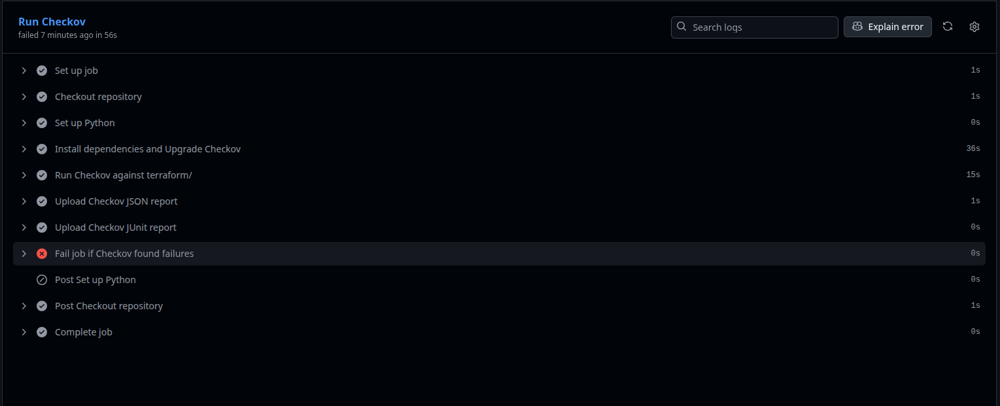

# 🛡️ Infrastructure Security Scanning with Terraform & Checkov


---

## 📌 Project Overview

This project demonstrates how to **automate infrastructure security audits** for Terraform using **Checkov**: a static analysis tool that detects misconfigurations and vulnerabilities before deployment.

It integrates seamlessly with **GitHub Actions** to enforce DevSecOps practices, ensuring that every infrastructure change meets your organization’s compliance and security standards **before** being merged or deployed.

---

## Key Concepts

| Category                 | Description                                                             |
| ------------------------ | ----------------------------------------------------------------------- |
| **IaC Security**         | Scans Terraform code for policy violations and misconfigurations.       |
| **DevSecOps Automation** | Integrates Checkov into CI/CD pipelines for continuous security checks. |
| **Policy Enforcement**   | Fails the build if non-compliant resources are found.                   |
| **Compliance Readiness** | Helps align with frameworks like CIS, NIST, and SOC2.                   |

---

## Architecture


---

## ⚙️ Tech Stack

* **Terraform**: Infrastructure as Code (AWS example)
* **Checkov**: IaC security scanner
* **GitHub Actions**: CI/CD automation
* **Python**: Local execution environment
* **jq**: JSON parser for result validation

---

## 📂 Repository Structure

```
terraform-checkov/
├── terraform/
│   ├── main.tf              # Demo Terraform config (AWS S3 + SG)
│   ├── variables.tf         # Terraform variables
│
├── .github/
│   └── workflows/
│       └── checkov.yml      # CI/CD workflow for Checkov scan
│
├── requirements.txt         # Python dependencies
├── .gitignore               # Ignored files and artifacts
├── README.md                # Documentation (you are here)
└── LICENSE                  # MIT License
```

---

## How It Works

1. **Developer pushes code / opens PR**
   → GitHub Actions triggers Checkov scan.

2. **Checkov runs security checks**
   → Scans all `.tf` files for insecure configurations.

3. **Reports generated automatically**

   * JSON and JUnit reports uploaded as artifacts.
   * PR blocked if critical issues are found.

4. **Fix violations**

   * Update Terraform to meet best practices.
   * Rerun workflow → merge only when compliant ✅.

---

## Run Locally

### 1️⃣ Install dependencies

```bash
python -m venv .venv
source .venv/bin/activate
pip install -r requirements.txt
```

### 2️⃣ Run Checkov manually

```bash
checkov -d ./terraform
```

### 3️⃣ Export report (optional)

```bash
checkov -d ./terraform --output json > checkov-report.json
```

---

## GitHub Actions Workflow

CI/CD pipeline runs automatically using:

```yaml
on:
  push:
  pull_request:
```

Steps:

* ✅ Checkout repo
* 🐍 Setup Python
* 🔍 Run Checkov scan
* 📊 Upload scan reports
* 🚫 Fail if violations exist


---

## 📈 Example Findings

| Issue                        | Rule ID      | Severity | Fix                                           |
| ---------------------------- | ------------ | -------- | --------------------------------------------- |
| S3 bucket is public          | `CKV_AWS_20` | High     | Use `private` ACL                             |
| Security group open to world | `CKV_AWS_23` | Critical | Restrict to known CIDRs                       |
| Missing encryption           | `CKV_AWS_19` | Medium   | Enable `server_side_encryption_configuration` |

### a Checkov found a security issue


---

## 🔒 Security Best Practices

* Encrypt all storage (S3, RDS, EBS)
* Restrict ingress rules to trusted IPs
* Use IAM roles with least privilege
* Enable versioning and MFA delete for critical resources
* Never commit credentials or secrets

---

## ✅ Skills Demonstrated

* **Terraform** (IaC)
* **Checkov** (Static Security Scanning)
* **CI/CD Automation** (GitHub Actions)
* **DevSecOps Practices**
* **Infrastructure Compliance & Policy Enforcement**

---

## 📘 Next Improvements

* Add Checkov custom policies (YAML) for your org
* Integrate with Slack for alerting
* Add Terraform `plan` validation
* Combine with **Bridgecrew** for cloud-native policy management

---

## 👨‍💻 Author

**Abdulrahman A. Muhamad**
DevOps | Cloud | SRE Enthusiast

🔗 [LinkedIn](https://www.linkedin.com/in/abdulrahmanalpha) • [GitHub](https://github.com/AbdulrahmanAlpha) • [Portfolio](https://abdulrahman-alpha.web.app)

---

## 🪪 License

This project is licensed under the **MIT License** – see the [LICENSE](./LICENSE) file for details.